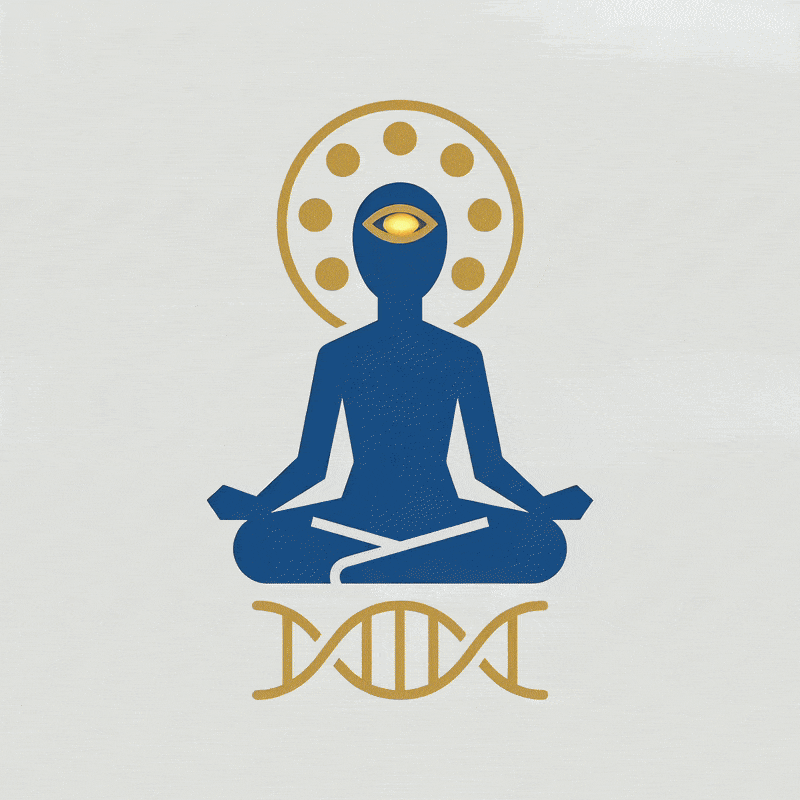

<p align="center">
  
</p>

<h1 align="center">ADAM OS</h1>
<p align="center"><b>The Integrated ADAM Operating System</b></p>

<p align="center">
  <a href="#">open source</a> ·
  <a href="#contributing">seeking contributors</a> ·
  <a href="#support">support on patreon</a>
</p>

<p align="center">
  <a href="LICENSE"></a>
  
  
</p>

---

## Does magic actually exist?

Perhaps it does, or perhaps it doesn't.

**Is there such a thing as cultivation of body and mind?**
Certainly there is — or perhaps there isn't.

**Do superhumans exist?**
They certainly do — or perhaps they don't.

Let us search together — for the dark light of the inner Dark Sun, and turn knowledge into the shape of reality.

Call it God, Source, Tao, the Self, or nothing at all — every tradition points to the same water. ADAM OS is not here to rename it. It is here to give you the tools to find it and the framework to experience it.

---

## Cultivation — Beginning Path

> *"Where the mind's focus goes, energy flows."*

> *"As you see, so you will think. As you think, so you will judge. As you judge, so your character will be shaped. As your character is shaped, so your actions will be. As your actions are, so your future will be."*

**Vision → Thought → Judgment → Character → Action → Future**

### 01 · Universal viewpoint — the Truth Eye
Step outside the self and look back at it — the eye of truth, seeing the whole before the part.

> *"Perhaps neither of us is wrong, yet neither has seen the whole truth."*

Even if we do not subscribe to another's perspective, let us learn to respect it. Our outlook on life shapes our thoughts, character, actions, and future.

### 02 · Ask the inner mind
Direct the question inward, not outward. The system does not answer to those who never ask.

### 03 · Ready the body and mind
Every tradition has a word for this discipline. The yogic path calls it **Brahmacharya** — conserving vital energy instead of spending it carelessly, then channeling it upward through **Prana-vayu**, the breath of life.

---

## The Equation

```
Brahmacharya
(Conservation of energy — the retention and stewardship of vital essence,
 rather than its dispersal)

        ↓  awakened by channeling that stored energy
           through Prana-vayu, the breath of life

Ojas Sublimation
(The refined vital essence generated when energy is
 conserved and rightly directed)

        ↓  manifests as

Good fortune · Self-confidence · Mental clarity · Creativity
(The visible traits of a mind and body under cultivation)

        ↓

    Success
```

---

## About the Project

ADAM OS is an **operating system for the self** — built in the open, for anyone, of any belief, searching for the same dark light.

- 🎬 [Watch the film](#)
- 🐙 [View on GitHub](#)
- ☕ [Support on Patreon](#support)

## Contributing

ADAM OS is open source and actively seeking contributors. Whether you work in code, content, design, or philosophy, there's a place for you here.

1. Fork the repository
2. Create a feature branch (`git checkout -b feature/your-idea`)
3. Commit your changes
4. Open a pull request

## Support

If ADAM OS resonates with you, consider supporting its development on [Patreon](#).

## License

Open source — see [`LICENSE`](LICENSE) for details.

---

<p align="center"><i>ADAM OS — Integrated ADAM Operating System · open source</i></p>
